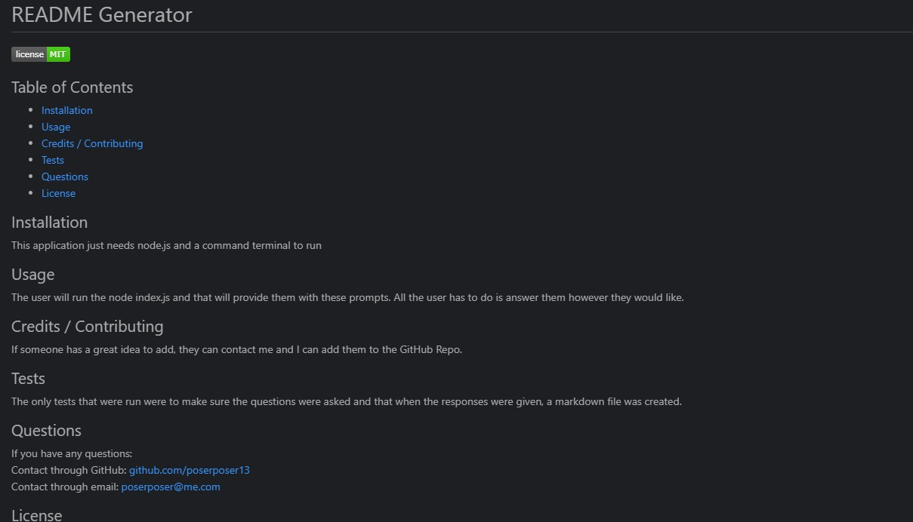
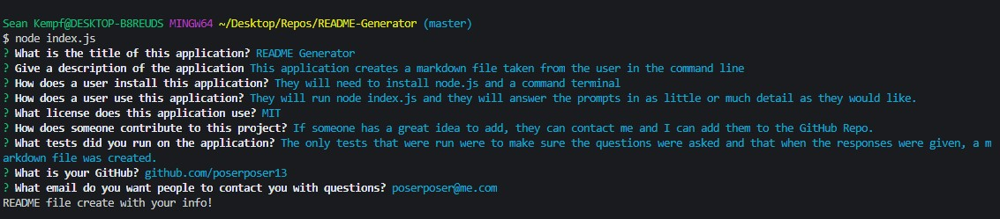

  # README Generator
  

  ## Table of Contents

* [Installation](#installation)
* [Usage](#usage)
* [Credits / Contributing](#contributing)
* [Tests](#tests)
* [Questions](#questions)
* [License](#license)

## Installation 
They will need to install node.js and a command terminal

## Usage
They will run node index.js and they will answer the prompts in as little or much detail as they would like. 

## Credits / Contributing
If someone has a great idea to add, they can contact me and I can add them to the GitHub Repo.

## Tests
The only tests that were run were to make sure the questions were asked and that when the responses were given, a markdown file was created. 

## Questions
If you have any questions:
 
Contact through GitHub: github.com/poserposer13
 
Contact through email: poserposer@me.com

## License 
This project is covered under the MIT license.

## Screenshots

